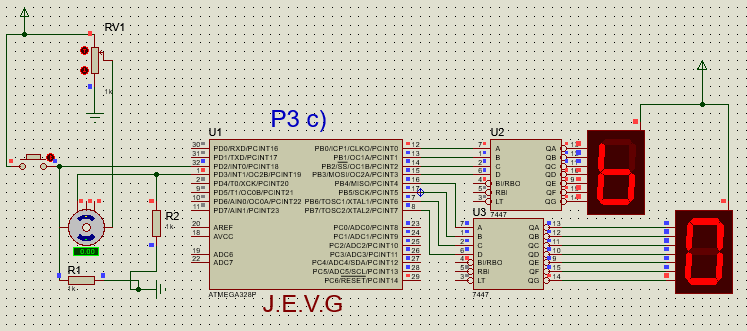

# Practice 3: External Interrupts

**Objective:**  
The student will learn and implement the use of the External Interrupt in their programs in assembly language, as well as the configuration of the sensing control in the INT0 and INT1 interrupts. They will also understand the importance of the Stack for the use of interrupts and the proper handling of the RETI and SEI instructions.

**Procedure:** 

1. Develop a dice roller where two counters are generated from 1 to 6 (one for each die) with a frequency change of 100 Hz, displaying the count with 7-segment displays; the external interrupt INT0 must be configured to detect the rising edge of a switch, this interrupt will control the pause of the counter showing the value of the roll on the two displays, the other external interrupt INT1 should be configured to detect the falling edges of another switch and its function will be to start the counter so that another person can roll again.  
**Challenge:** Include a switch to turn on the counter.

            

     
    <strong><em>  
Exercise 1: Dice Shooting Simulator with Interrupts and 7-Segment Displays
    </em></strong>

   
    <strong>     <h3> 
        Simulation result 
    </strong>       </h3>     
     

   

https://github.com/JoseEmmanuelVG/MicrocontrollersAndInterface/assets/89156254/a50cb7de-48f2-4a84-87d9-8e65d25a51d1

2. Program a 16-bit pulse counter, configuring the external interrupt INT1 so the program counts the rising edges of a switch or an encoder (for higher pulse speed it is advised to use a photodiode and phototransistor coupled to a DC motor or a pulse train circuit), the counter should be displayed in binary form through the 16 LEDs, enabling a reset to the pulse counter.

            

     
    <strong><em>  
Exercise 2: 16-Bit Pulse Counter with LED Display and Reset.
    </em></strong>

   
    <strong>     <h3> 
        Simulation result 
    </strong>       </h3>     
     

 

3. With the help of the previous exercise, generate a pulses per second counter.

            

     
    <strong><em>  
Exercise 3: Interruption-Based Pulse Rate Per Second Meter
    </em></strong>

   
    <strong>     <h3> 
        Simulation result 
    </strong>       </h3>     
     

 

4. Create a circuit that simulates a quiz game machine, where there are two teams with 4 people each, and each person has a button in front of them. When a question is asked, the first contestant to press the button, the circuit should light up a signal that identifies which team pressed the button, in addition to disabling all other buttons. To unlock the buttons and turn off the signal light, a switch that can reset to the initial state should be considered. Use external interrupts to solve the circuit.

            

     
    <strong><em>  
Exercise 4: Quick Response System for Question Set with Button Lockout
    </em></strong>

   
    <strong>     <h3> 
        Simulation result 
    </strong>       </h3>     
     

 

   

### Reference
- David Benjamin T. S. (2024). Class presentations: Microprocesadores, Microcontrollers and Interface. UPIITA, National Polytechnic Institute. School year 2024-1.

  
🌟 Did you find any repository useful?

  If any project has been helpful to you, consider giving it a ⭐ star in the repository and follow my GitHub account to stay tuned for future updates! 🚀

  In addition, I am always open to suggestions, recommendations or collaborations. Feel free to [get in touch](https://www.linkedin.com/in/vazquez-galan-jose-emmanuel-664968221) if you have any questions or ideas for improving this project. I'm excited for your feedback and contributions.

  Thank you for your interest and support! 😊

 This work is licensed under a <a rel="license" href="http://creativecommons.org/licenses/by-nc-sa/4.0/">Creative Commons Attribution-NonCommercial-ShareAlike 4.0 International License</a>.

